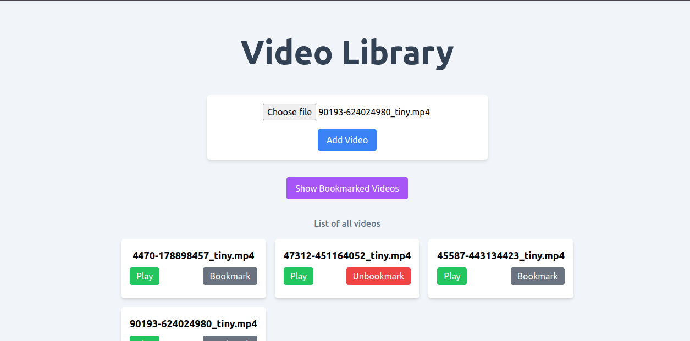
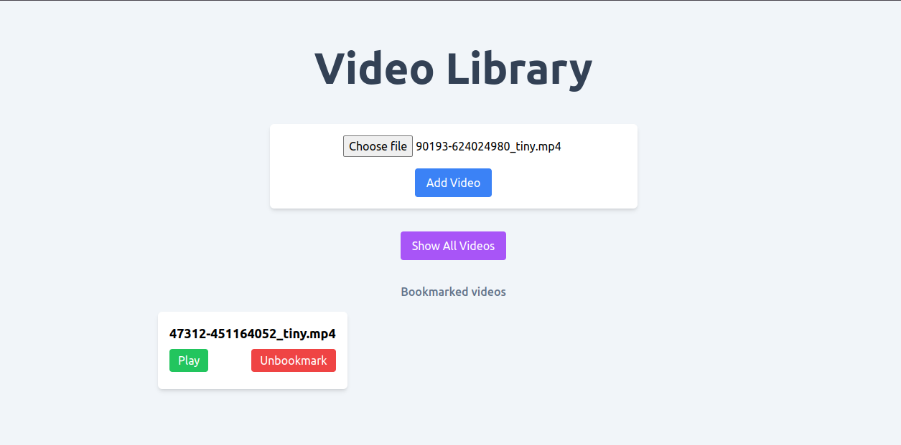
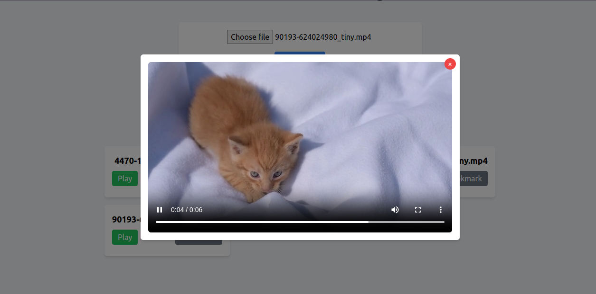

# Video Library Web App

## Deployed Link: https://video-library-gamma.vercel.app/

## Overview
The Video Library Web App allows users to manage their personal collection of videos. Users can add videos from their system, view a list of all added videos, play individual videos in a popup, bookmark videos, and filter the list to show only bookmarked videos.







## Features
- **Add Videos:** Users can add videos from their local system.
- **View Video List:** Users can see a list of all the videos they have added.
- **Play Videos:** Users can play individual videos in a popup.
- **Bookmark Videos:** Users can bookmark and unbookmark videos.
- **Filter Bookmarked Videos:** Users can filter the video list to show only bookmarked videos by clicking on "Show bookmarked video" button.

## Tech Stack
- **Framework:** React.js
- **Styling:** Tailwind CSS
- **State Management:** Redux Toolkit

## Getting Started

### Prerequisites
- Node.js (version 14.x or later)
- npm (version 6.x or later)

### Installation
1. Clone the repository:
   ```bash
   git clone https://github.com/MOHDSAMIULLAH/video-library.git
   cd video-library
   ```

2. Install the dependencies:
   ```bash
   npm install
   ```

3. Start the development server:
   ```bash
   npm start
   ```

4. Open your browser and navigate to `http://localhost:3000` to see the app in action.

